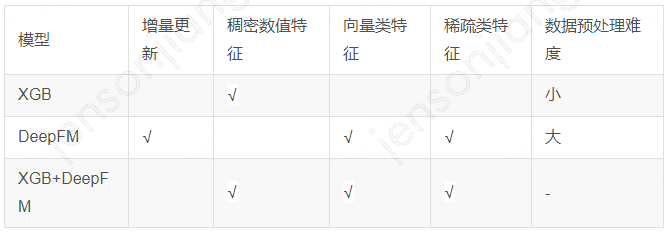

XGB具有对稠密连续数值特征支持较好，数据预处理工作量小等优势。但存在对向量，稀疏类特征支持较差，另外无法进行增量学习的劣势。
DeepFM对向量类特征，稀疏类特征支持较好，但对稠密连续数值特征支持较差，另外需要大量特征归一化，离散化工作。
简单通过LR将XGB+DeepFM结合结合两者在特征的优势，降低数据预处理工作量，但由于XGB无法增量跟新，增加了增量学习系统建设的复杂性。

如何让XGB+DeepFM更好的进行增量更新呢？DeepGBM通过对GBDT树模型进行结构蒸馏得到一个NN结构，通过LR与DeepFM进行融合得到了一个End2End的模型，较圆满的解决了上述问题。

GBDT+LR：Practical lessons from predicting clicks on ads at facebook；https://git.code.oa.com/AI_algorithm/xgboost_plus_lr

Gradient Boosted Decision Tree Neural Network（https://arxiv.org/pdf/1910.09340）
