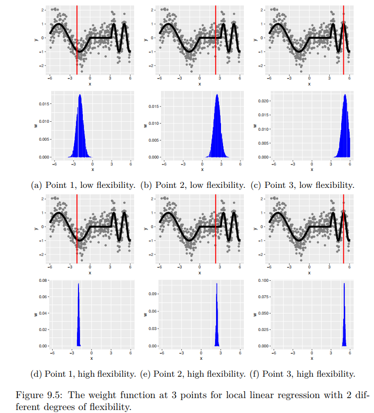
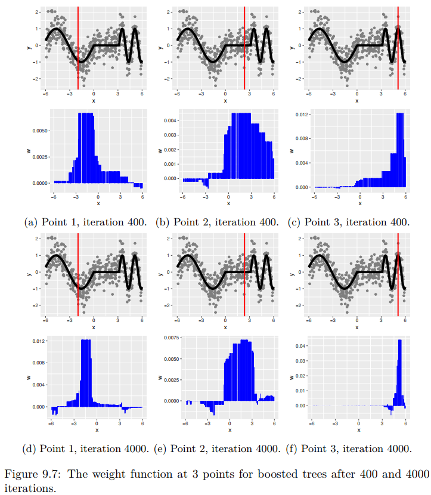

### 存在的问题
1. 分叉是贪心的，导致特征之间的组合不是很好
2. 正则项是对树深、叶子数做的限制，无法解决单个分叉过拟合某个特征的问题；线性模型的正则项可以避免这个问题

### 性能优势
树模型在线上推理的性能很高，只要进行几千次的分支判断即可

### Why Does XGBoost Win “Every” Competition

#### Adaptive Neighbourhoods
因为可以动态调整邻域（Adaptive Neighbourhoods）

许多模型都可以表示为
$$ \hat{f}(x) = \hat{w}(x)^T y $$

即，对于一个新样本$x$，$\hat{w}$给出每个训练样本的权重，然后对所有训练样本的$y$值做加权平均。

例如线性回归，
$$ \hat{f}(x) = x^T(X^TX)^{-1}X^Ty $$

树模型也可以类似表示，因为叶节点的$y$值就是所有落在该节点的训练样本的$y$值的平均。

加权平均时，越均等的权重，模型的方差越低。假定每个样本的$y$值为随机变量，那么
$$ \mathrm{Var}\left[\hat{f}(x)\right] = \mathrm{Var}\left[\sum_i\hat{w}_i(x)Y_i\right] = \sum_i \hat{w}_i(x)^2 \mathrm{Var}\left[Y_i\right] = \mathrm{Var}\left[Y_i\right]\sum_i \hat{w}_i(x)^2 $$

因此权重越均等，方差越低。

局部线性回归模型下，拟合下图的数据点，可以看出，在每个x的位置上，训练样本的权重分布都差不多，因此不会动态调整邻域。

对于boosting方法，其训练样本的权重分布则更为灵活，可以看到，在x的不同位置上，其权重分布相差很大。

#### 不使用距离度量
因此避免了维度灾难

#### 通过树深去捕捉特征之间的交互（interaction）
