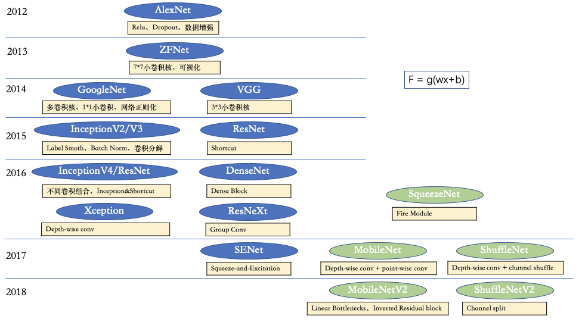
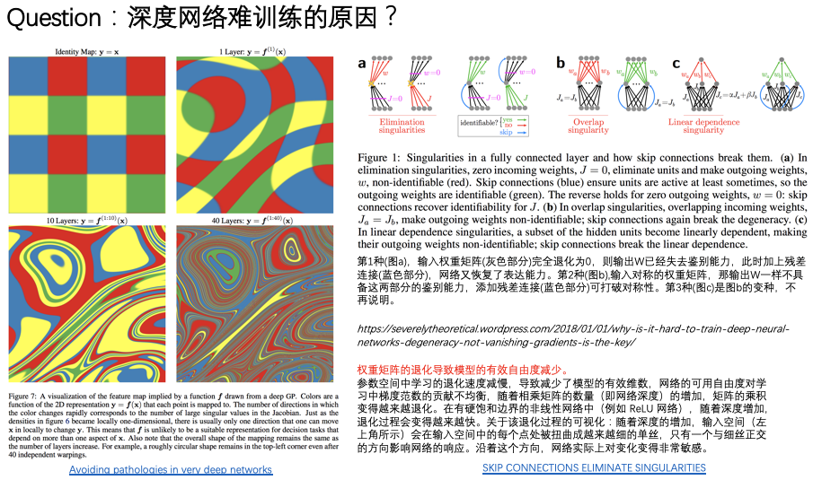
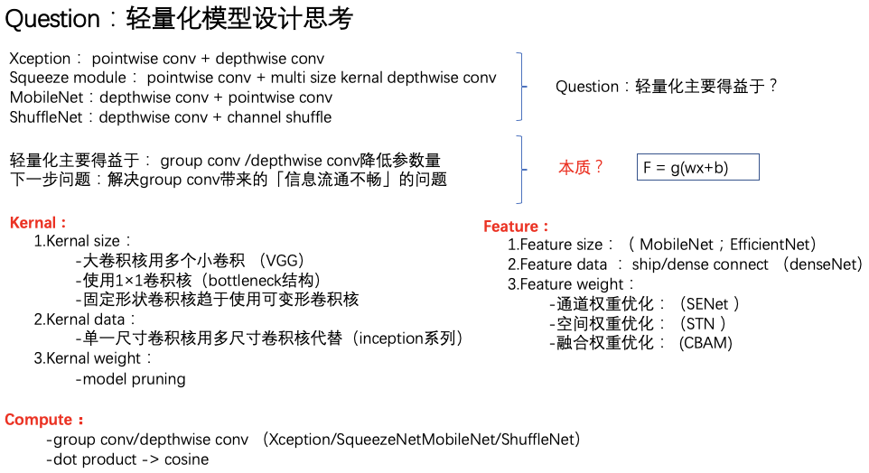
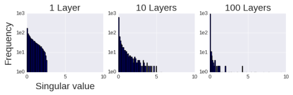

## 深层网络之路

加深加宽网络，提升模型复杂度来增强拟合能力。但会存在两个问题：一是容易过拟合，测试集不准；二是梯度容易不稳定，模型难训练。所以早期的alexnet、inception、resnet研究各种方法在模型加宽加深的防止模型过拟合和梯度不稳定等。
- 防过拟合：dropout、数据增强、label smoothing
- 防梯度不稳定：relu、shortcut、batchnorm

如果不加宽加深，首先神经网络本质是f=g(wx+b)。从本质角度思考，可优化的有如下几点：
- g对应激活函数：历史上实验不同激活函数（sigmod、tanh等）对性能的影响；自从relu及其变种提出后基本一统天下。
- w对应kernal：例如inception系列V1、V2、V3实验各种多尺寸卷积等本质就是优化w。
- x对应feature：例如densenet的feature reused；senet利用attention等本质就是优化x。

[KM文章](http://km.oa.com/group/33427/articles/show/401816)，作者alynnachen(陈琳)

2015年InceptionV2/V3沿着V1的思想，进一步探索不同卷积分解的模型。如下图，1个5\*5替换成2个3\*3，或3\*3替换成1\*3和3\*1，这就叫卷积分解。

“轻量化”主要得益于depth-wise conv，因此大家可以考虑采用depth-wise conv来设计自己的轻量化网络，但是要注意解决depth-wise conv带来的信息流通不畅问题。
回归到本质F=g(wx+b)，那么我认为上面的轻量化操作其实本质是“变相的矩阵分解”。因为卷积运算本质是个矩阵运算；那么实际上Depwise conv结合cnn的原理设计一个矩阵运算分解方式；如果我们能设计更有效率的矩阵运算分解方式且最大限度减少信息损失，那么也许是开启另一种革新浪潮的my conv

### 深度网络难以训练的原因
[博文](https://severelytheoretical.wordpress.com/2018/01/01/why-is-it-hard-to-train-deep-neural-networks-degeneracy-not-vanishing-gradients-is-the-key/)，作者Emin Orhan

梯度消失或爆炸，可追溯到Bengio的文章[Learning Long-Term Dependencies
with Gradient Descent is Difficult](http://ieeexplore.ieee.org/stamp/stamp.jsp?arnumber=279181)。

但实际上，可能是网络退化的问题，例如[Exact solutions to the nonlinear dynamics of learning in deep linear neural networks](https://arxiv.org/abs/1312.6120)。把随机初始化的矩阵，上半部分copy到下半部分，会导致性能大幅下降，因为矩阵的自由度下降了。把网络的权值初始化为正交矩阵，则会大幅提升网络性能。

从奇异值的角度，网络越深，奇异值分布约趋近于0，如下图

跳跃连接可以避免网络退化，如文章[SKIP CONNECTIONS ELIMINATE SINGULARITIES](https://openreview.net/pdf?id=HkwBEMWCZ)所论述。

这篇文章[Resurrecting the sigmoid in deep learning through dynamical isometry: theory and practice](https://arxiv.org/abs/1711.04735)在hard-tanh激活函数的情况下，实现了正交初始化，实验表明训练速度大幅加快。

### 网络结构

#### Highway Network
受LSTM启发，引入门式结构的跳跃连接。

**分析方法**
- 每层中门的平均激活程度，随层数的变化
- 单个case的门的激活程度，随层数的变化
- 各层重要度：将这一层的门置为0，即直接传递输入，看每一层对结果的影响

**时代局限**
- 没有BN、weight norm
- 没有Dropout
- SGD with momentum, learning rate decay

#### ResNet

#### DenseNet

数据服从正态分布的好处

### 正态性假设

### 初始化方法

### 输入数据归一化

### weight norm
TODO

### batch norm
每一层的输出都重新做正态性的归一化

#### Motivation

#### 起作用的原因
- 正态性
- 正则化：大的权重会导致小的梯度

#### 激活之前 or 之后做？

#### 存在的问题
- 不适用于RNN，因为对于不同批次，同一次循环的分布都不太一致
- 特征之间需要对比的情况不适用，因为特征做了归一化，抹除了相对的大小关系
- 不适用于回归问题，[-1,1]的定义域不利于回归问题
  - 如果特征均被归一化，那么回归时bias变得重要且敏感
  - 均值和方差各自的作用？不减均值则bias不重要；不除以标准差则权重不易学
